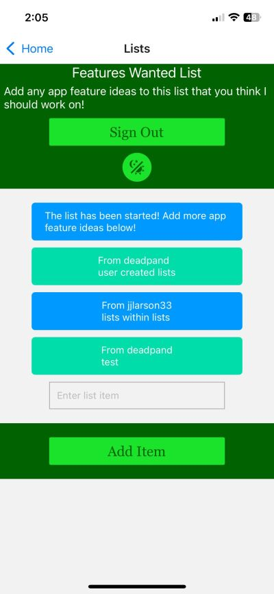

# react_native_final

The final project result from a react native application class. A basic list app done with react native and firebase auth.

- - - -

- - - -

- - - -

- - - -

- - - -

## Requirements

[React_Native-Final_Project.rtf](React_Native-Final_Project.rtf "React_Native-Final_Project.rtf")

## How to Install / Run
You will likely want to install the Expo go app on your mobile device for testing. You may try using a browswer but the support is limited and you may face unknown issues.

The best way to see the result is through expo go. After following all the instructions listed below, there will be a QR code you can scan with your mobile device camera.
Scanning the QR code should prompt an option to open in the Expo go app if you have it installed. 

These instructions are for running the project on a pc or similar device, the above instructions are for viewing the running project on your mobile device.

Open project folder with IDE of choice (recommended: Visual Studio Code)
enter into bash, the command below - 
### `npm install -g expo-cli`

next, enter into bash, the command below -
### `npm install`

next, enter into bash, the command below -
###`npx expo start`
